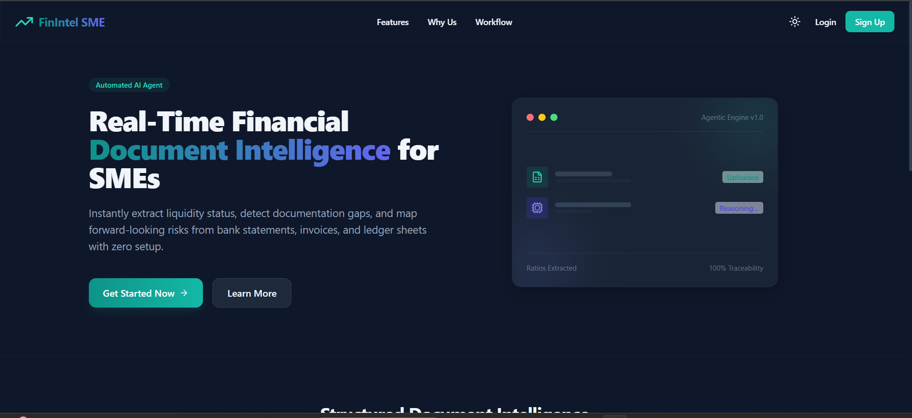
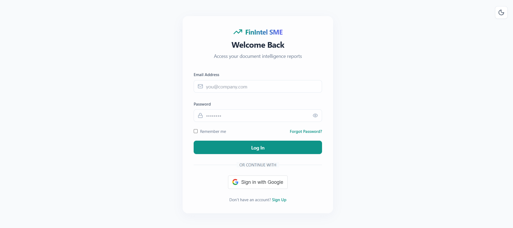
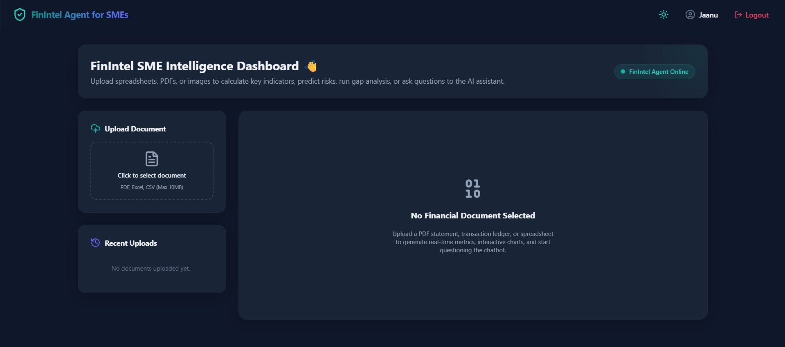
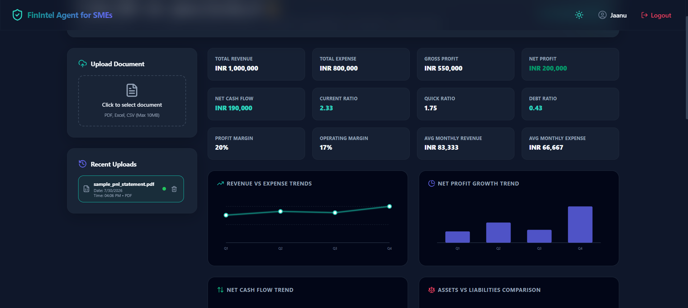
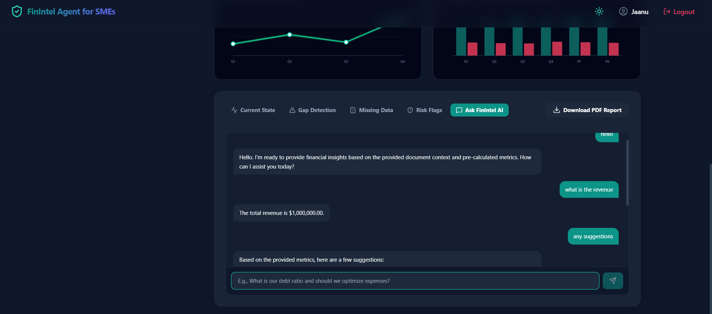
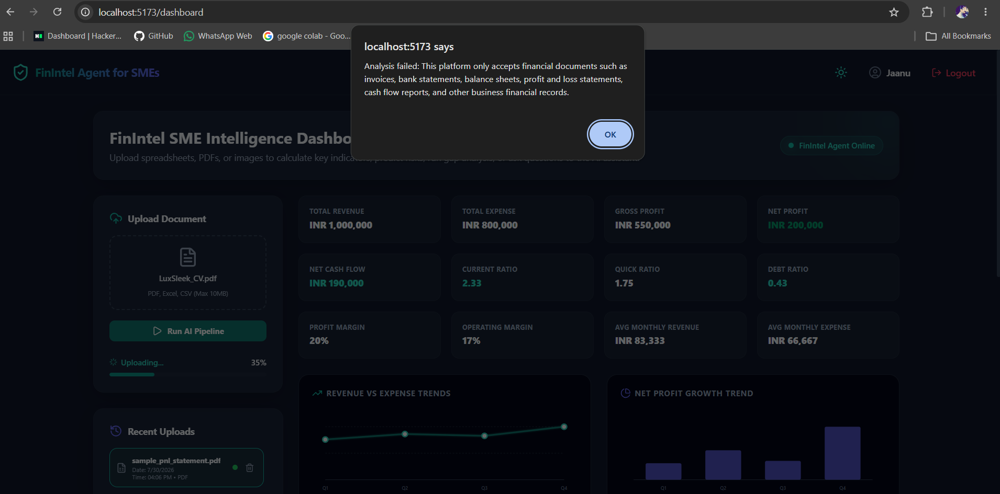

# 🚀 FinIntel SME – AI-Powered Financial Intelligence Platform

FinIntel SME is an AI-powered financial document intelligence platform designed for Small and Medium Enterprises (SMEs). It enables businesses to upload financial documents, extract key financial indicators, analyze risks, generate insights, interact with an AI assistant, and download automated reports.

---

## 📌 Overview

Managing financial documents manually is time-consuming and error-prone.

FinIntel SME automates the process by:

- Extracting financial information from uploaded documents
- Calculating key business metrics
- Detecting financial risks and data gaps
- Providing AI-generated financial insights
- Generating downloadable PDF reports
- Supporting real-time financial decision-making

---

## ✨ Key Features

### 📄 Financial Document Processing
- Upload PDF, Excel, and CSV files
- Automated document validation
- Financial data extraction

### 📊 Financial Analytics Dashboard
- Revenue Analysis
- Expense Tracking
- Gross Profit Calculation
- Net Profit Calculation
- Cash Flow Analysis
- Current Ratio
- Quick Ratio
- Debt Ratio

### 🤖 AI Financial Assistant
- Ask questions about uploaded financial documents
- Get AI-generated recommendations
- Receive business insights and suggestions

### ⚠️ Risk & Gap Detection
- Missing data identification
- Financial gap analysis
- Risk flag generation
- Business health monitoring

### 📑 Report Generation
- Download financial reports in PDF format
- Automated summary generation

### 🔐 Authentication
- User Registration
- Login System
- Google OAuth Authentication

---

## 🛠️ Tech Stack

### Frontend
- React.js
- Vite
- Tailwind CSS
- Axios

### Backend
- Flask
- Python

### Database
- MongoDB
- MySQL
- SQLite (Fallback)

### AI & Data Processing
- Pandas
- NumPy
- Vector Search
- Financial Analysis Engine

---

## 📸 Application Screenshots

### Landing Page



### Login & Authentication



### Dashboard Home



### Financial Analytics Dashboard



### AI Financial Assistant



### Document Validation & Risk Detection


## 📂 Project Structure

```text
SME-Financial-Management/
│
├── backend/
│   ├── agents/
│   ├── database/
│   ├── models/
│   ├── routes/
│   ├── services/
│   └── app.py
│
├── frontend/
│   ├── public/
│   ├── src/
│   └── package.json
│
├── datasets/
├── requirements.txt
├── run.py
└── README.md
```

---

## ⚙️ Installation

### Clone Repository

```bash
git clone https://github.com/Jahnavicheepurupalli/SME-Financial-Management.git
cd SME-Financial-Management
```

### Backend Setup

```bash
python -m venv venv

venv\Scripts\activate

pip install -r requirements.txt
```

### Frontend Setup

```bash
cd frontend

npm install

npm run dev
```

### Run Application

```bash
python run.py
```

---

## 🔄 Workflow

1. User Login / Signup
2. Upload Financial Document
3. Document Validation
4. Financial Data Extraction
5. Metric Calculation
6. Risk Analysis
7. AI Recommendation Generation
8. Dashboard Visualization
9. PDF Report Download

---

## 📈 Sample Metrics Generated

- Total Revenue
- Total Expense
- Gross Profit
- Net Profit
- Net Cash Flow
- Profit Margin
- Operating Margin
- Current Ratio
- Quick Ratio
- Debt Ratio

---

## 🔒 Security

- Environment Variable Configuration
- Google OAuth Integration
- Secure Authentication
- Protected API Access

---

## 🚀 Future Enhancements

- Predictive Financial Forecasting
- Advanced Risk Scoring
- Multi-user SME Collaboration
- Cloud Deployment
- Real-time Business Alerts
- Interactive Financial Reports

---

## 👩‍💻 Developed By

**Jahnavi Cheepurupalli**

B.Tech – Computer Science & Machine Learning

GitHub:
https://github.com/Jahnavicheepurupalli

---

⭐ If you found this project useful, consider giving it a star.
